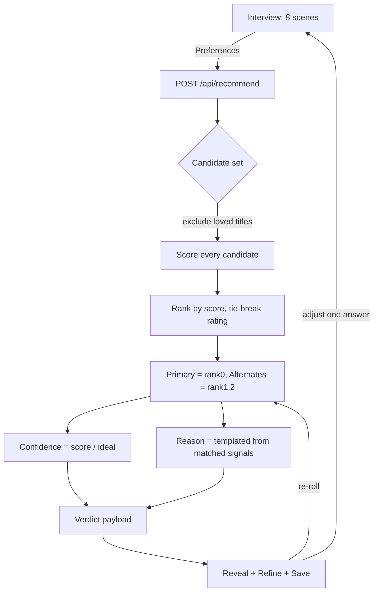
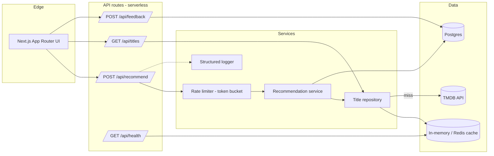

# Filmnyt AI — Architecture

> A taste-and-mood interview that commits to **one decisive recommendation** (plus two
> alternates) with a human-readable reason. This document is the production blueprint;
> the shipped `Filmnyt AI.dc.html` is a faithful, fully-working front-end + engine
> prototype of the flow described here.

---

## 1. System overview

```
 Guest / User
     │  (interview answers)
     ▼
┌─────────────┐   POST /api/recommend   ┌──────────────────────┐
│  Front-end  │ ───────────────────────▶│  Recommendation svc  │
│ (interview, │                         │  (scoring + ranking) │
│  verdict)   │◀─────────────────────── │                      │
└─────────────┘    pick + 2 alternates  └──────────┬───────────┘
     │                                             │
     │ GET /api/titles (autocomplete)              │ candidate set
     ▼                                             ▼
┌─────────────┐                          ┌──────────────────────┐
│ Client cache│                          │  Title repository    │
│ (SWR)       │                          │  cache → TMDB → seed  │
└─────────────┘                          └──────────────────────┘
```

The recommendation engine is **stateless and deterministic**: the same answers + the
same candidate set always produce the same verdict. State (profile, watchlist, verdict
history) lives behind a storage abstraction so it can move from local persistence to a
real database without touching UI or engine code.

---

## 2. Entities

| Entity | Key fields | Notes |
|---|---|---|
| **User** | `id`, `email?`, `role` (`guest` \| `user`), `createdAt` | Guests get an ephemeral id; sign-in promotes the same id. |
| **Preferences** | `type` (movie\|series\|surprise), `mood`, `energy` (1–5), `genres[]`, `era` (classic\|modern\|any), `maxRuntime`, `loved[]` (titleIds), `services[]` | One snapshot per `Session`. The 8 interview answers. |
| **Title** | `id`, `tmdbId`, `title`, `year`, `type`, `runtime`, `seasons?`, `rating`, `genres[]`, `moods[]`, `energy`, `classic`, `services[]`, `createdBy`, `posterPath`, `backdropPath` | `moods`/`energy` are Filmnyt-curated; the rest mirror TMDB. |
| **Recommendation** | `sessionId`, `primaryId`, `alternateIds[]`, `confidence`, `reason`, `scoreBreakdown` | The verdict. `scoreBreakdown` makes confidence explainable. |
| **Session** | `id`, `userId`, `preferences`, `recommendation`, `createdAt` | One interview → verdict cycle. |
| **Watchlist** | `userId`, `items[]` (titleId, savedAt) | User-scoped; survives across sessions. |

---

## 3. Data flow: interview → scoring → verdict



---

## 4. System architecture (production)



**Layering:** UI → API route (validation + rate limit) → recommendation service →
title repository (cache → TMDB → seeded fallback) → response. The **TMDB key never
leaves the server** — the browser only ever talks to our own `/api/*` routes.

---

## 5. Recommendation engine (the actual contract)

Deterministic, pure, unit-tested. `score(title, prefs, lovedProfile)` returns a number
and a `reasons` breakdown. Weights as implemented:

| Signal | Rule | Weight |
|---|---|---|
| Genre overlap | `count(prefs.genres ∩ title.genres)` | `× 3` each |
| Mood match | `title.moods includes prefs.mood` | `+6` |
| Energy fit | `(4 − |title.energy − prefs.energy|)` | `× 1.6` |
| Runtime fit | within limit → `+3`; over → `− min(4, over/15)` | ± |
| Era | match → `+3`; mismatch → `−2.5`; `any` → `0` | ± |
| Streaming | available on a selected service → `+2.5`; on none → `−6` | ± |
| Loved affinity | shared genres `×1.2` + shared moods `×1.0`, capped | `+0…7` |
| Format mismatch | `type≠prefs.type` (and not "surprise") | `× 0.25` |
| Quality nudge | `(rating − 7)` | `× 0.4` |

**Ranking:** sort by score desc, tie-break by rating then id (stable). Loved titles are
**excluded** from candidates (never recommend what they already love). **Confidence** =
`score / idealScore` clamped to 54–99, where `idealScore` is the maximum reachable given
how many dimensions the user actually expressed. **Reason** is composed from the
strongest matched signals (mood phrase + genre + energy + runtime/era/service/loved
clause) — one sentence, always grounded in the inputs.

**Routes**
- `POST /api/recommend` — body: `Preferences`; returns `{ primary, alternates[2], confidence, reason, scoreBreakdown }`.
- `GET  /api/titles?q=` — autocomplete over the title corpus (used by the "loved titles" step).
- `POST /api/feedback` — body: `{ sessionId, titleId, signal: 'reroll'|'save'|'reject' }` for future learning-to-rank.
- `GET  /api/health` — liveness + cache/DB reachability.

---

## 6. Database schema (Postgres)

```sql
create table users (
  id          uuid primary key default gen_random_uuid(),
  email       text unique,
  role        text not null default 'guest' check (role in ('guest','user')),
  created_at  timestamptz not null default now()
);

create table titles (
  id           text primary key,
  tmdb_id      integer unique,
  title        text not null,
  year         integer not null,
  type         text not null check (type in ('movie','series')),
  runtime      integer not null,
  seasons      integer,
  rating       numeric(3,1) not null,
  genres       text[] not null,
  moods        text[] not null,
  energy       integer not null check (energy between 1 and 5),
  services     text[] not null default '{}',
  created_by   text,
  poster_path  text,
  backdrop_path text
);

create table sessions (
  id           uuid primary key default gen_random_uuid(),
  user_id      uuid references users(id) on delete cascade,
  preferences  jsonb not null,
  recommendation jsonb,
  created_at   timestamptz not null default now()
);

create table watchlist_items (
  user_id   uuid references users(id) on delete cascade,
  title_id  text references titles(id),
  saved_at  timestamptz not null default now(),
  primary key (user_id, title_id)
);

create index on sessions (user_id, created_at desc);
create index on titles using gin (genres);
```

---

## 7. Auth & permissions

- **Guest mode** works end-to-end with an ephemeral id (cookie/localStorage). No account
  required to land → interview → verdict → save.
- **Sign-in** (planned: NextAuth or Supabase Auth, email + OAuth-ready) promotes the
  guest id to a `user` and migrates their local watchlist/history server-side.
- **Roles:** `guest` (own ephemeral data) and `user` (own persisted data). All
  watchlist/history reads and writes are scoped to the owning `userId`; a verdict belongs
  to its session's owner.

---

## 8. Caching & CDN

- **Title lookups** cached server-side (in-memory locally, Redis in prod), keyed by
  `tmdbId`/query, TTL ~24h (catalogue changes slowly).
- **Recent verdicts** memoised per normalized-preferences hash for the session.
- **Client** uses an SWR-style cache for `/api/titles` autocomplete (debounced 200ms).
- **Heavy assets** (poster/backdrop images) are served from TMDB's CDN with explicit
  aspect ratios + `srcset`, lazy-loaded; in prod, fronted by edge ISR so popular titles
  render from cache.

## 9. Rate limiting

Per-session **token bucket** in front of `/api/recommend` and any outbound TMDB fetch
(e.g. 20 req / 10s, refill 2/s). On exhaustion the API returns `429` and the UI shows a
friendly "give it a second…" state rather than failing the verdict.

## 10. Security & threat model

- **Input validation:** every interview field is validated/sanitized server-side (enum
  whitelists for type/mood/era/service, numeric bounds for energy/runtime, id-existence
  for loved titles) before scoring. Untrusted strings never reach a query unescaped.
- **Secrets:** `TMDB_API_KEY` and DB creds are server-only env vars, never bundled or
  returned to the client; all third-party calls are proxied through `/api/*`.
- **Headers:** strict CSP, `X-Content-Type-Options`, `Referrer-Policy`, HTTPS assumed.
- **Threats considered:** key exfiltration (mitigated by proxy), injection (validation +
  parameterized queries), scraping/abuse (rate limiting), and data leakage across users
  (every query scoped by `userId`).

## 11. Scaling

- API routes are **stateless** → scale horizontally behind the platform's autoscaler.
- Inputs debounced; lists paginated/virtualized; the engine is O(n) over a bounded
  candidate set and runs in well under a frame.
- The 3D/parallax layer lazy-loads and never blocks first paint; particle counts capped;
  `prefers-reduced-motion` serves a flat equivalent.

## 12. Observability

- **Error boundaries** around the app; if data, network, or motion fails, the verdict
  flow still completes against the seeded fallback.
- **Structured logging** behind a thin wrapper (pluggable to Sentry), with `/api/health`
  for liveness.
- **Metrics to watch:** p95 `/api/recommend` latency, error rate, recommend-success rate,
  TMDB cache hit-ratio, 429 rate. Alert thresholds documented per environment.

## 13. Testing strategy

- **Unit (Vitest):** the scoring function — determinism, each weight, tie-breaking,
  loved-title exclusion, confidence clamping.
- **Component (Testing Library):** each interview step (selection, gating, back/next).
- **E2E (Playwright):** one happy path — land → interview → verdict → re-roll → save.
